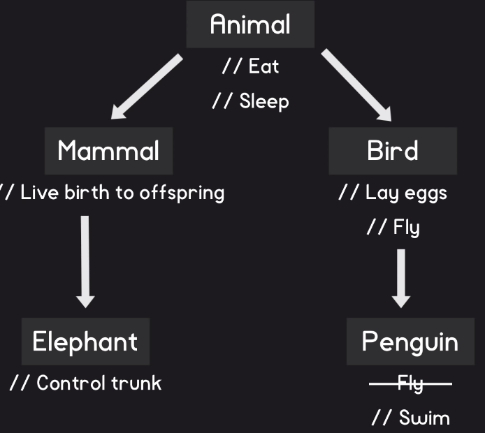
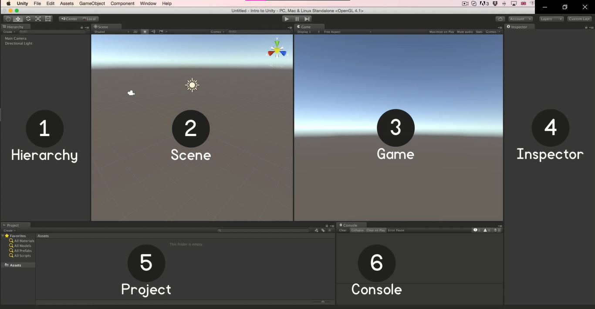
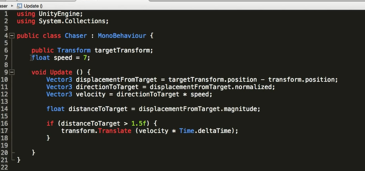
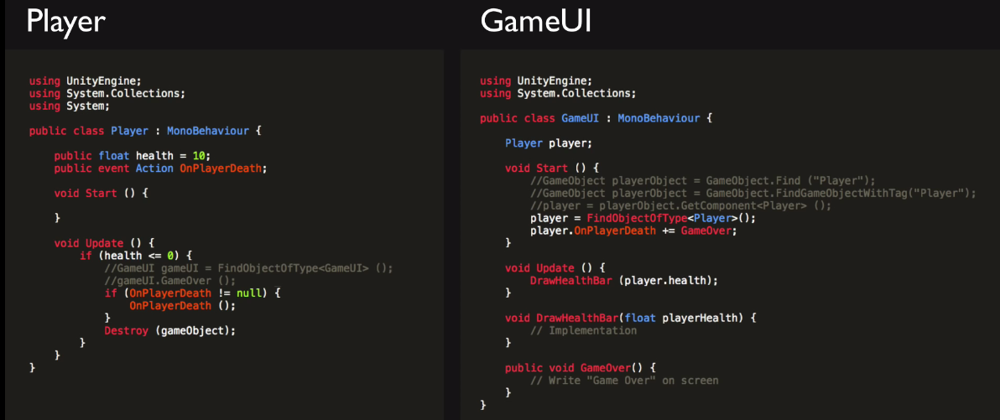

# Sebastian's tutorials

[kmfmd](#E7)

**E1.**


Variable - name to which data can be assigned.


| var    | example                  |
| -------- | -------------------------- |
| int    | playerHealth = 15;       |
| float  | playerHealth = 15f;      |
| bool   | playerHealth = true;     |
| string | playerHealth = 'health'; |

Functions means a specific task, so that it can be called from multiple places.

---

**E2.**

Classes  = var + functions.

Inheritance



Composition


**Formally, “instance” is synonymous with “object” as they are each a particular value (realization), and these may be called an instance object; “instance” emphasizes the distinct identity of the object. The creation of an instance is called instantiation.**

---

**E3.**

Overview of Unity interface.



---

**E4.**
Writting code for getting distance between 2 points.

---

**E5.**

operators and if statements.

**% - The remainder operator % computes the remainder after dividing its left-hand operand by its right-hand operand.**

``` csharp
Console.WriteLine(**5** % **4**);   **// output: 1**
Console.WriteLine(**5** % **-4**);  **// output: 1**
Console.WriteLine(**-5** % **4**);  **// output: -1**
Console.WriteLine(**-5** % **-4**); **// output: -1**
```

---

**E6.**
simple game with `public class TimeGame;`

---

## E7

vectors:

vector2 - for 2d;

vector3 - for 3d;

---
## E8


adding movement intro game.

---
## E9

writting roration script.

```csharp
public class CubeScript : MonoBehaviour {
    public Transform sphereTransform;

    void Start(){
        sphereTransform.parent = transform;
    }

    void Update(){
        transform.eulerAngles += new Vector3 (0, 180 * Time.deltaTime, 0);
    }
}
```
Use Transform.Rotate to rotate GameObjects in a variety of ways.

---

## E10

collision (столкновение).
Collisions in Unity are separated from the actual Sprite itself, attached as separate components and are calculated on their own.

**Everything** in game is GameObject.

---

## E11

video about prefabs and instantion. 
prefabs - type of assets that keep GameObject with all components and properties.

```csharp
using UnityEngine;
using System.Collections;

public class FurnitureSpawner : MonoBehaviour {
    public GameObject chairPrefab;

    void Start(){

    }
    void Update(){
        if(Input.GetKeyDown(KeyCode,Space)){
            Vector3 randomSpawnPosition = new Vector3(Random.Range(-10f,10)0, Random.Range(-10f,10f));
            Vector3 randomSpawnPosition = Vector3.up * Random.Range(0,360);

            GameObject newChair = (GameObject)Instantiate  (chairPrefab, randomSpawnPosition, Quaternion.Euler(randomSoawnRotation));
            newChair.transform.patent = transform;
        }
    }
}
```

--- 
## E12



---

## E13

making game about falling blocks;

```csharp
using UnityEngine;
using System.Collecrions;

public class PlayerController : MonoBehaviour{
    public float speed = 7;

    float screenHalfWidthInWorldUnits;

    void Start(){
        float halfPlayerWidth = transform.localScale.x / 2f;
        screenHalfWidthInWorldUnits = Camera.main.aspect * Camera.main.orthographicSize + halfPlayerWidth;
    }
    void Update(){
        float inputX = Input.GetAxisRaw("Horizontal");
        float velocity = inputX * speed;
        transform.Translate (Vector2.right * velocity * Time.deltaTime);

        if(transform.position.x < -screenHalfWidthInWorldUnits){
            transform.position = new Vector2 (screenHalfWidthInWorldUnits, transform.pisition.y);
        }
        if (transform.position.x > screenHalfWidthInWorldUnits){
            transform.position = new Vector2 (-screenHalfWidthInWorldUnits, transform.pisition.y);
        }
    }
}
```

---

## E14

```csharp
using UnityEngine;
using System.Collections;

public class Spawner : MonoBehaviour{
    public GameObject fallinBlockPrefab;
    public float secondBetweenSpawns =1;
    float nextSpawnTime;
    
    public Vector2 spawnSizeMax;
    public float spawnAngleMax;

    Vector2 screenHalfSizeWorldUnits;

    void Start(){
        screenHalfSizeWorldUnits = new Vector2 (Camera.main.aspect * Camera.main.orthographicSize, Camera.main.orthographicSize);
    }
    void Update(){
        if(Time.time > nextSpawnTime){
            nextSpawnTime = Time.time + secondBetweenSpawns;

            float spawnAngle = Random.Range (-spawnAngleMax, spawnAngleMax);
            float SpawnSize = Random.Range (spawnSizeMinMax.x, spawnSizeMinMax.y);
            Vector2 spawnPosition = new Vector2 (Random.Rande (-screenHalfSizeWorldUnits.x, screenHalfSizeWorldUnits.x), screenHalfSizeWorldUnits.y +spawnSize);
            GameObject newBlock = (GameObject)Instantiate (fallinBlockPrefab, spawnPosition, Quaternion.Euler(Vector3.forward * spawnAngle));
           // Instatiate (fallingBlockPrefab, spawnPosition, Quaternion.identity);
           newBlock.transform.localScale = Vector2.one * spawnSize;
        }
    }
}
```

```csharp
using UnityEngine;
using System.Collections;

public class FallingBlock : MonoBehaviour{
    float speed = 7;

    void Update (){
        transform.Translate(){
            transform.Translate (Vector3.down * speed * Time.deltaTime, Space.Self);
        }
    }
}
```